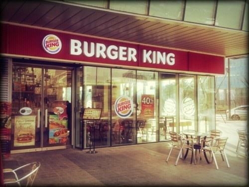
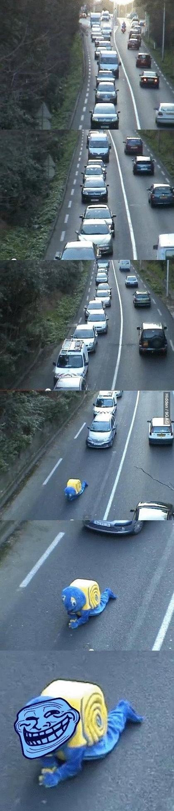

# 8. 성능 향상을 위한 인프라 구조

## 8.1. 응답과 처리량

### 8.1.1 성능 문제의 두 가지 원인

- 시스템 성능과 관련하여 인프라 쪽에서 중요한 두가지는 **응답(Response)**과 **처리량(Throughput)**이다.
- 응답 시간 : 결과과 표시되기까지 걸리는 시간 (한 명의 사용자 관점 지표)
- 처리량 : 초당 받아 들이는 사용자 수 (서비스 제공자 관점 지표)

- 판교 버거킹을 예로 들어보면
- 우리가 주문을 하기 위해 줄을 선 순간부터 와퍼를 받기 까지 걸리는 시간이 응답 시간
- 버거킹 입장에서는 단위 시간당 햄버거를 만들어서 고객에게 전달하는 것 까지가 처리량이라고 할 수 있다.
- 실제 시스템에서는 1분간 1000http 와 같은 형식으로 표현한다.
- 응답 시간과 같은 경우는 단인 사용자 시간만으로는 정확도 및 근사값 측정이 불가능하기 때문에 퍼신타일이라는 개념을 사용해 표현한다.
  
### 8.1.2 응답 문제
- 응답 문제가 발생한다면, 시스템 어떤 계층에서 응답 지연이 발생하고 있는지 파악해야 한다.

- 네트워크 지연 또한 무시하지 못한다. 앞에서 학습한 것과 같이 여러 스위치나 라우터를 공유하기 때문에 해당 부분에서 지연이 생길 수 밖에 없다.
- 다만 물리적인 한계로 인해 어쩔 수 없는 제약이 존재한다. 이때는 처리량 개선을 통해 시스템 전체 사용률을 개선하는것이 일반적이다.

### 8.1.3 처리량 문제
- 물리적인 대역폭등과 같은 문제로 처리량 관점의 병목 현상이 발생하기도 한다.
- 또한 CPU & 메모리 와 디스크 & 네트워크 사이에 속도 차이 때문에 병목 현상이 발생 하기도 한다.
- 소프트웨어 관점에서 본다면 CPU가 처리를 감당하지 못해 대기가 발생하고, 처리량 한계를 초과할 수도 있다.
- 즉 다수의 요청이 한번에 몰린다면 막히기 쉽다. 그렇기 때문에 응답 시간과 처리량은 밀접한 관계가 있다.
- 응답이 매우 느리다면 시스템 요청이 쌓여 전체 처리량도 떨어지고, 처리량이 포화 상태가 되면 리소스가 부족해져서 응답 속도도 느려진다.

## 8.2 병목 현상이란?

### 8.2.1 처리 속도의 제한 요소가 되는 병목 현상
- 인프라 아키텍처 용어로서 병목 현상이란, 처리량을 제한하고 있는 요인을 가리킨다.
- 3계층형 시스템을 예로들어 보면 AP 서버, DB 서버 등 한곳에서 응답 시간이 지연 된다면 이부분을 병목 지점이라고 할 수 있다.

### 8.2.2 병목 현상은 어떻게 해결하는가?
- 성능 분석의 시작은 이 병목 현상이 발생하고 잇는 위치를 정확히 파악하는 것이다.

**병목 현상 해결 방법**
- 두가지 방법이 있는데 첫번째가 병목 위치에 대한 **튜닝**이다.
- 이떄는 병목 위치를 작은 단위로 '세분화' 해서 영역을 더 '집중적으로' 파헤치는 접근법이 유효하다.
- 두번째 방법은 사용자 수를 제한하는 것이다.
- 실제로 이러한 방법은 '유량 제어'라는 방법으로 많이 사용하고 있다. 
- 다만 근본적인 해결책은 되지 못한다.

### 8.2.3 병목 지점은 반드시 존재한다.
- 병목 지점은 시스템상에 '반드시' 존재한다.
- 모든 서버, 소프트웨어, 물리 장비가 균등하게 처리량을 분배하는 것은 이론상 불가능하기 때문이다.
- 성능 개선시에는 반드시 정량적인 기준을 잡고 목표를 정하는 것이 중요하다.

## 8.3 3계층형 시스템 그림을 통해 본 병목 현상
- CPU 병목 현상
- 메모리 병목 현상
- 디스크 I/O 병목 현상
- 네트워크 I/O 병목 현상
- 애플리케이션 병목 현상

### 8.3.1 CPU 병목 현상 예
- CPU '사용률'은 처리 효율성을 나타내는 것으로 병목현상과는 크게 상관이 없다.
- CPU가 바쁘다는것은 오히려 처리량이 매우 좋다는 뜻이기도 하다.
- CPU에 기인한 성능 문제는 주로 다음 두 가지 원인으로 분류할 수있다.
  - CP를 이용하는 처리가 많아서 대기 행렬이 발생하고 있다.
  - CPU 응답이 느리다.

**대기 행렬의 병목 현상**
- 100% 가동률로 일하고 있음에도 대기 행렬이 줄어들지 않는 상태
- CPU 사용률이 높고 OS 상에서 가동하고 있는 프로세스 수가 맣으면 대기 행렬에서 병목 현상이 발생한다.
- CPU 사용률만 보고 있으면 알기 어려운 사항으로 주의가 필요하다.
- 대기 행렬의 병목 현상은 처리량 측면의 문제를 의미한다.
- 코어수를 늘리거나 처리 자체를 짧게 만드는 방법이 유효하다.
- CPU 코어 수가 많은 것으로 늘리거나 수평 분할(스케일 아웃) 을 통해 튜닝이 가능하다.
  
**응답의 병목 현상**
- 기본 처리량이 높다고 해도 처리 속도 자체가 느리다면 응답의 병목 현상은 존재한다.
- 이런 응답 시간을 개선하는 방법이 몇가지 있다.
- **처리 능력을 향상시킨다.**
  - 스케일업(Scale-up)을 통해 처리 능력을 향상시킨다.
  - CPU '클럭수'가 속도 부분에 해당한다.
  - 하지만 물리적 한계로 인해서 무한정 속도를 올리는것은 불가능하다.
- **병렬로 처리한다.**
  - 처리를 분할해서 다수의 CPU 코어에게 동시 처리를 시키는 것이다.
  - 하나의 처리를 복수의 CPU 코어를 이용해서 전체적인 응답 시간을 향상 시킬 수 있다.
  - 이런 부분은 인프라 문제보다 어플리케이션 개발자의 협조가 필요하다.

**CPU 사용률이 오르지 않는다.**
- 대부분의 애플리케이션에서 CPU 사용률이 100% 에 도달하는 경우는 거의 없다.
- 그전에 디스크 I/O나 네트워크 I/O 에서 막히는 경우가 많기 때문이다.
- 동기 I/O 같은 경우 커널에 명령이 갈 겨우, 이것이 완료되지 않으면 프로세스가 다음 처리를 하지 않는다.
- 대기 상태가 되면 CPU 사용률은 낮아지고 I/O 대기 큐에 프로세스는 증가한다.
- 이런경우 I/O 병목 현상이지만 정확히는 애플리케이션이 CPU, 메모리, I/O 등의 하드웨어 리소스를 제대로 활용하지 못하는 것이 주된 문제다.
- **처리 다중화**
  - 처리 병렬화와 기본적으로 같은 개념으로 처리를 다중화 한다.
  - ㅡ레드를 여러 개 가동해서 동기 I/O 명령을 스레드 단위로 병행해서 실행하면 CPU 사용률도, I/O 부하도 증가한다.
- **I/O 비동기화**
  - 비동기 I/O를 이용하면 프로세스는 I/O 처리 완료를 기다리지 않고 다음으로 넘어갈 수 있다.
  - CPU 처리와 I/O 처리를 동시에 진행할 수 있기 때문에 리소스 사용 상태가 개선된다.

> C는 자바보다 빠르다?

### 8.3.2 메모리 병목 현상 예
- 메모리 영역의 병목 현상은 크게 두 가지로 나눌 수 있다.
  - 영역 부족
  - 동일 영역의 경합
**영역 부족에 의한 병목 현상**
- 커널은 페이징 또는 스와핑이라는 것을 통해 메모리 영역 관리를 한다.
- 이때 디스크 영역을 메모리 영역처럼 사용하는 가상 메모리 기술이 있다.
- 이러한 부분은 결국 디스크를 사용하다보니 메모리-디스크 사이에 성능차가 발생하고 여기서 병목 현상이 발생하게 된다.
- 특히 DB 서버에서 이러한 이슈가 많이 발생한다.
- 공유 메모리 영역(SGA)은 사전에 지정한 크기만큼만 사용하기 때문에 문제가 아니지만, 프로세스별 사용 메모리 영역(PGA)은 자동 확장된다. 
- 여기서 메모리 영역이 늘어나고 페이징이 발생해 성능 악화를 초래한다.

**동일 데이터에 대한 병목 현상**
- 메모리에 데이터를 캐시해도 메모리에서 경합이 발생하는 경우도 있다.
- 갱신이나 참조를 하는 프로세스가 경합해서 빠른쪽이 그 영역을 독점하기 때문에 해당 부분에서 병목이 발생한다.
- 이러한 부분을 대키큐를 통해 처리 하려고 하지만 오히려 큐를 유지하는 리소스가 더 들기도 한다.
- 이러한 문제는 같은 메모리 영역을 복수의 프로세스나 스레드가 참조하지 않도록 만들어ㅑ 한다.

### 8.3.3 디스크 I/O 병목 현상
- 디스크 I/O는 메모리와 비교해서 느리다.
- I/O가 병목 지점이 될 때는 CPU 수를 늘리거나 클럭 주파수를 높여도 소용이 없다.
- I/O 효율을 높이든가 I/O를 줄이는 방법을 고민해야 한다.

**외부 저장소**
- 많은 기업형 환경에서는 데이터베이스의 저장 위치로 외부 저장소를 사용한다.(SAN, NAS)
- 사실 어플리케이션 관점에서는 디스크 I/O의 시스템 콜이 발행되고, OS 커널 측에서 필요한 프로토콜로 요청을 변경해서 디스크나 저장소 측에 요청을 전달한다.
- 그렇기 때문에 기록 위치가 로컬인지 외부인지는 의식할 필요가 없다.